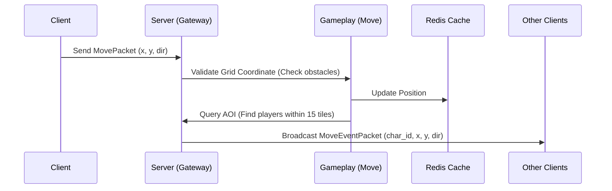

# Bản Thiết Kế Chi Tiết Cấu Trúc Dự Án, Module & Cơ Sở Dữ Liệu (GDD)

Bản thiết kế này cung cấp sơ đồ phân rã thư mục, các module nghiệp vụ của Client - Server, lược đồ cơ sở dữ liệu chi tiết (SQL) và mô hình quản lý cache thời gian thực trên Redis để phục dựng game **Tây Du Ký Mobile (J2ME)**.

---

## 1. Công Nghệ Đã Lựa Chọn (Selected Tech Stack)
*   **Thu thập đồ họa:** Bung gói file gốc `.jar` (Decompile) để lấy 100% tài nguyên ảnh pixel PNG/GIF và âm thanh gốc.
*   **Client Engine:** **Unity (C#)** để phát triển 2D và xuất bản trực tiếp lên Google Play / App Store.
*   **Server Engine:** **Golang (Go)** làm máy chủ hiệu năng cao kết nối qua TCP socket.
*   **Cơ sở dữ liệu:** **PostgreSQL** (lưu trữ vĩnh viễn) & **Redis** (đồng bộ thời gian thực).

---

## 2. Cấu Trúc Thư Mục Dự Án (Project Directory Structure)

### A. Cấu trúc Server (Golang Backend)
Thiết kế theo mô hình Clean Architecture để dễ bảo trì, mở rộng và viết unit test:


```text
tayduky-server/
│
├── cmd/
│   └── server/
│       └── main.go                 # Điểm khởi chạy ứng dụng (Entrypoint)
│
├── config/
│   └── config.go                   # Đọc và quản lý biến môi trường (.env, yaml)
│
├── internal/
│   ├── gateway/                    # Quản lý cổng kết nối
│   │   ├── client_manager.go       # Quản lý danh sách connection online
│   │   ├── websocket.go            # Xử lý kết nối WebSocket (cho Web client)
│   │   └── tcp.go                  # Xử lý kết nối Raw TCP (cho Mobile client)
│   │
│   ├── gameplay/                   # Nghiệp vụ logic trong game
│   │   ├── move/                   # Module di chuyển trên bản đồ dạng lưới (AOI)
│   │   ├── combat/                 # Module chiến đấu đánh theo lượt (Turn-based)
│   │   ├── quest/                  # Hệ thống quản lý nhiệm vụ & phụ bản
│   │   ├── pet/                    # Quản lý ấp trứng, nâng cấp, tẩy tủy Tiên sủng
│   │   └── chat/                   # Xử lý kênh chat thế giới, bang hội, mật
│   │
│   ├── models/                     # Khai báo các Struct ánh xạ DB và Network Packet
│   │   ├── character.go
│   │   ├── packet.go
│   │   └── database.go
│   │
│   └── database/                   # Tương tác cơ sở dữ liệu
│       ├── postgres.go             # Cấu hình kết nối GORM / PostgreSQL
│       └── redis.go                # Cấu hình Go-Redis
│
├── proto/                          # Định nghĩa các gói tin giao tiếp nhị phân
│   └── game.proto                  # File Protobuf định nghĩa Packet
│
├── go.mod
└── go.sum
```

### B. Cấu trúc Client (Unity 2D Project)
Tổ chức thư mục chuẩn để phục dựng game 2D Pixel Art trên Unity:

```text
tayduky-client/
│
└── Assets/
    ├── Prefabs/                    # Các cấu trúc lắp sẵn tái sử dụng
    │   ├── Characters/             # Nhân vật người chơi, NPC, Quái vật
    │   ├── Pets/                   # 700 loại tiên sủng
    │   └── UI/                     # Khung chat, thanh HP/MP, Bảng điều khiển
    │
    ├── Resources/                  # File dữ liệu tĩnh
    │   ├── Quests/                 # JSON cấu hình chuỗi nhiệm vụ thỉnh kinh
    │   └── Items/                  # JSON cấu hình vũ khí, tiên dược, thú cưỡi
    │
    ├── Scenes/                     # Các màn hình game
    │   ├── LoginScene.unity        # Màn hình đăng nhập
    │   ├── WorldScene.unity        # Màn hình chạy map thế giới
    │   └── CombatScene.unity       # Màn hình chiến đấu turn-based
    │
    ├── Scripts/                    # Lập trình mã nguồn C#
    │   ├── Network/                # Kết nối Socket, gửi/nhận packet
    │   ├── Controllers/            # Điều khiển nhân vật di chuyển trên Grid Tilemap
    │   ├── UI/                     # Điều khiển Canvas, thanh máu dọc, phím Nhanh
    │   └── Managers/               # Quản lý trạng thái Game (GameManager, SoundManager)
    │
    └── Sprites/                    # Tài nguyên hình ảnh Pixel Art
        ├── Characters/             # Hoạt ảnh Sprite Sheet (Đi, Cưỡi hổ, Phi kiếm)
        ├── Maps/                   # Bộ gạch (Tile Palette) tạo map Thiên Đình, Trường An
        └── UI/                     # Hình ảnh nút bấm, biểu tượng (Icons)
```

---

## 2. Thiết Kế Cơ Sở Dữ Liệu Chi Tiết (Database Schema)

Chúng tôi sử dụng PostgreSQL làm DB chính để lưu trữ vĩnh viễn và Redis để quản lý cache thời gian thực.

### A. Lược đồ PostgreSQL (SQL DDL Script)

```sql
-- 1. Bảng tài khoản người dùng
CREATE TABLE accounts (
    id SERIAL PRIMARY KEY,
    username VARCHAR(50) UNIQUE NOT NULL,
    password_hash VARCHAR(255) NOT NULL,
    email VARCHAR(100),
    status INT DEFAULT 1, -- 1: Hoạt động, 0: Bị khóa
    created_at TIMESTAMP DEFAULT CURRENT_TIMESTAMP
);

-- 2. Bảng nhân vật trong game
CREATE TABLE characters (
    id SERIAL PRIMARY KEY,
    account_id INT REFERENCES accounts(id) ON DELETE CASCADE,
    name VARCHAR(50) UNIQUE NOT NULL,
    faction VARCHAR(20) NOT NULL CHECK (faction IN ('Thần Tộc', 'Ma Tộc', 'Yêu Tộc', 'Chưa Vào')),
    level INT DEFAULT 1,
    exp INT DEFAULT 0,
    vip_level INT DEFAULT 0,
    hp_max INT DEFAULT 100,
    hp_current INT DEFAULT 100,
    mp_max INT DEFAULT 50,
    mp_current INT DEFAULT 50,
    gold INT DEFAULT 0,      -- Tiền vàng thông dụng
    knb INT DEFAULT 0,       -- Kim Nguyên Bảo (nạp thẻ)
    map_id INT DEFAULT 1,    -- Bản đồ hiện tại (mặc định 1: Hội Bàn Đào)
    pos_x INT DEFAULT 12,    -- Tọa độ X trên lưới
    pos_y INT DEFAULT 8,     -- Tọa độ Y trên lưới
    created_at TIMESTAMP DEFAULT CURRENT_TIMESTAMP
);

-- 3. Bảng danh mục Thú cưỡi (Tọa kỵ)
CREATE TABLE character_mounts (
    id SERIAL PRIMARY KEY,
    character_id INT REFERENCES characters(id) ON DELETE CASCADE,
    mount_type VARCHAR(50) NOT NULL, -- 'Bạch Hổ', 'Hỏa Kỳ Lân', 'Phi Kiếm'...
    level INT DEFAULT 1,
    speed_bonus INT NOT NULL,        -- % tốc độ cộng thêm
    is_equipped BOOLEAN DEFAULT FALSE -- Có đang cưỡi hay không
);

-- 4. Bảng danh sách Tiên sủng (Pets) của nhân vật
CREATE TABLE character_pets (
    id SERIAL PRIMARY KEY,
    character_id INT REFERENCES characters(id) ON DELETE CASCADE,
    name VARCHAR(50) NOT NULL,
    pet_type VARCHAR(50) NOT NULL,   -- 'Thỏ Ngọc', 'Tiểu Toàn Phong', 'Kỳ Lân Con'
    grade VARCHAR(20) NOT NULL CHECK (grade IN ('Trân Thú', 'Tán Tiên', 'Kim Tiên')),
    level INT DEFAULT 1,
    exp INT DEFAULT 0,
    str INT DEFAULT 10,              -- Sức mạnh
    int_stat INT DEFAULT 10,         -- Trí tuệ
    vit INT DEFAULT 10,              -- Thể lực
    agi INT DEFAULT 10,              -- Thân pháp
    hp_max INT DEFAULT 80,
    hp_current INT DEFAULT 80,
    skills JSONB,                    -- Mảng các kỹ năng pet học (tối đa 6 ô)
    is_summoned BOOLEAN DEFAULT FALSE
);

-- 5. Bảng hành trang của nhân vật (Inventory)
CREATE TABLE inventories (
    id SERIAL PRIMARY KEY,
    character_id INT REFERENCES characters(id) ON DELETE CASCADE,
    slot_index INT NOT NULL,         -- Vị trí ô trong hòm đồ (1 - 40)
    item_id INT NOT NULL,            -- ID vật phẩm (tham chiếu file tĩnh json)
    quantity INT DEFAULT 1,
    is_bound BOOLEAN DEFAULT FALSE,  -- Đồ khóa/không giao dịch được
    UNIQUE(character_id, slot_index)
);

-- 6. Bảng tiến trình nhiệm vụ của nhân vật
CREATE TABLE character_quests (
    id SERIAL PRIMARY KEY,
    character_id INT REFERENCES characters(id) ON DELETE CASCADE,
    quest_id INT NOT NULL,           -- ID nhiệm vụ (tham chiếu file tĩnh json)
    status VARCHAR(20) DEFAULT 'IN_PROGRESS' CHECK (status IN ('IN_PROGRESS', 'COMPLETED')),
    progress_count INT DEFAULT 0,    -- Số lượng quái đã giết/vật phẩm đã nhặt
    updated_at TIMESTAMP DEFAULT CURRENT_TIMESTAMP
);
```

### B. Thiết kế Cấu trúc Cache trên Redis (Real-time Storage)
Dùng để quản lý trạng thái di chuyển thời gian thực và đồng bộ mạng cực nhanh:

1.  **Lưu vị trí tọa độ người chơi hiện tại (phục vụ hệ thống AOI):**
    *   *Kiểu dữ liệu:* Redis Geospatial (GEO) hoặc Hash.
    *   *Key:* `char:position`
    *   *Member:* `[Character_ID] -> value: "map_id,x,y"`
    *   *Tác vụ:* Khi người chơi di chuyển, Server chỉ cần gọi `HSET char:position [ID] "1,15,22"` để cập nhật tọa độ thay vì ghi xuống DB PostgreSQL.
2.  **Thông tin phiên đăng nhập (Session):**
    *   *Kiểu dữ liệu:* String.
    *   *Key:* `session:[Character_ID]`
    *   *Value:* `Token_Chuỗi / IP_Client`
    *   *TTL (Hết hạn):* 3600 giây (1 giờ).
3.  **Kênh chat thế giới tạm thời (Queue):**
    *   *Kiểu dữ liệu:* List (FIFO).
    *   *Key:* `chat:world`
    *   *Tác vụ:* Lưu tối đa 50 tin nhắn chat gần nhất để gửi cho người chơi mới đăng nhập.

---

## 3. Cấu Trúc Các Module Chức Năng Chính (Module Architectures)

### A. Module Di chuyển & Đồng bộ AOI (Area of Interest Manager)
*   **Chức năng:** Đồng bộ bước di chuyển của nhân vật cho những người chơi khác trên bản đồ mà không gây nghẽn mạng.
*   **Luồng xử lý di chuyển:**


### B. Module Chiến đấu đánh theo lượt (Turn-based Combat Engine)
*   **Chức năng:** Quản lý lượt đánh của Chủ tướng và Pet.
*   **Luồng xử lý:**
    1.  *Khởi tạo:* Khi đụng độ quái vật trên map, Server khóa trạng thái di chuyển của nhân vật trên thế giới, chuyển cả hai bên vào trạng thái **InCombat**.
    2.  *Lượt đấu (Round):* 
        *   Server đếm ngược 15 giây chờ Client gửi lệnh hành động (`Attack`, `Skill`, `Item`).
        *   Nếu hết 15 giây chưa nhận lệnh, Server tự động kích hoạt chế độ **Auto** (tấn công thường).
    3.  *Tính toán sát thương:* Thực hiện hoàn toàn ở phía Server (Dựa trên: Công vật lý/phép, thủ vật lý/phép, tỷ lệ chí mạng, kháng thuộc tính).
    4.  *Phát kết quả:* Gửi gói tin hoạt ảnh kết quả chiến đấu (`CombatResultPacket`) về Client để hiển thị hoạt ảnh mất máu/kỹ năng.
    5.  *Kết thúc:* Khi HP một bên về 0, giải phóng trạng thái chiến đấu, cấp EXP/Vàng/Đồ rớt, cập nhật DB và chuyển nhân vật về World map.

---

## 4. Đặc Tả Gói Tin Giao Tiếp Mạng (API / Packet Contracts)

Các gói tin gửi qua WebSocket/TCP được đóng gói bằng cấu trúc JSON mẫu sau (giai đoạn Prototype) hoặc Proto file (giai đoạn Production):

### Gói tin Yêu cầu Di chuyển (Client gửi lên Server):
*   **Action ID:** `1001`
```json
{
  "action_id": 1001,
  "character_id": 1024,
  "target_x": 15,
  "target_y": 22,
  "direction": "EAST",
  "is_riding": true
}
```

### Gói tin Phản hồi Vị trí cho AOI (Server phát sóng cho xung quanh):
*   **Action ID:** `2001`
```json
{
  "action_id": 2001,
  "character_id": 1024,
  "name": "shinichi",
  "current_x": 15,
  "current_y": 22,
  "direction": "EAST",
  "mount_type": "Hỏa Kỳ Lân",
  "timestamp": 1781845672
}
```

### Gói tin Báo cáo Chat (Broadcast Chat):
*   **Action ID:** `2005`
```json
{
  "action_id": 2005,
  "sender_id": 1024,
  "sender_name": "shinichi",
  "chat_channel": "WORLD", -- WORLD, FACTION, GUILD, WHISPER
  "message": "Ai đi phụ bản Hái Trộm Đào Tiên không?",
  "timestamp": 1781845700
}
```
