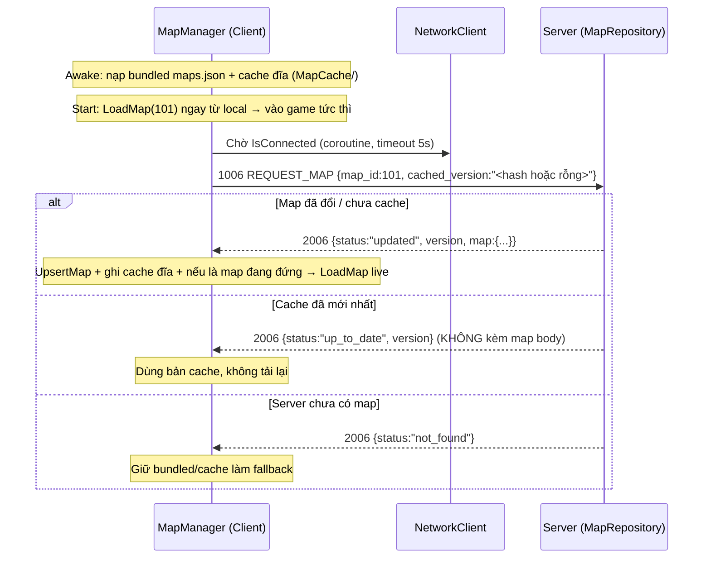
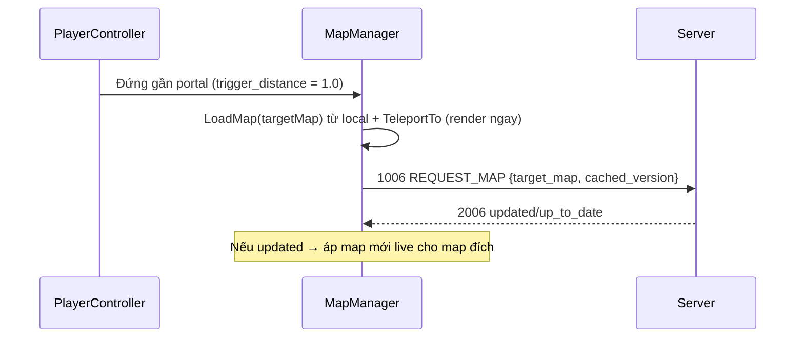
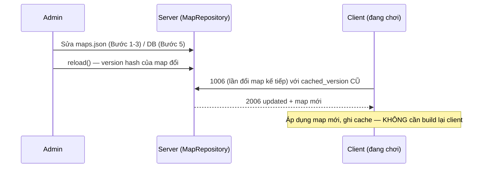

# Đề Xuất Tái Thiết Kế Hệ Thống Map (Dynamic / Admin-Customizable Maps)

Tài liệu này ghi lại đề xuất kiến trúc để chuyển hệ thống map của **Tây Du Ký 2D** từ trạng thái **tĩnh, nhúng trong client** sang **động, do server quản lý** — cho phép admin tùy biến map trên môi trường sandbox/production mà không cần build lại client, tối ưu chi phí băng thông và dễ bảo trì trong code.

---

## 1. Vấn đề hiện tại (Problem Statement)

- `maps.json` nằm **bên trong build client** (`tayduky-client/Assets/Resources/Maps/`).
- Cả client (`MapManager.cs`) lẫn server (`server.py`) đọc **chung file** này qua đường dẫn tương đối → coupling chặt.
- Hệ quả:
  - Muốn sửa map = **build lại + phát hành lại app** → admin không thể custom trên sandbox/prod.
  - `obstacles` đang **liệt kê tay từng ô** (241 ô cho 1 map 24×24) → không thể bảo trì khi có nhiều map.
  - Không có versioning → không kiểm soát được thay đổi, không tối ưu băng thông.

---

## 2. Tư tưởng cốt lõi (Core Principle)

> **Server là nguồn chân lý (source of truth); client tải map lúc runtime và cache lại.**

```
Admin sửa map ──> [Nguồn chân lý: File/DB trên server]
                          │
              (client xin map khi login / đổi map)
                          ▼
   Client tải JSON + cache theo version ──> render
```

Client **không còn nhúng** `maps.json` (giữ làm fallback ở giai đoạn chuyển tiếp) → sửa map chỉ cần cập nhật server.

---

## 3. Lựa chọn lưu trữ (Storage Options — theo chi phí tăng dần)

| Phương án | Cách làm | Chi phí | Phù hợp |
|---|---|---|---|
| **A. File JSON trên server** | Admin sửa file, server hot-reload | ~0đ | Sandbox, team nhỏ |
| **B. PostgreSQL (JSONB)** | Map là 1 row, admin CRUD qua panel | Thấp (đã có DB trong thiết kế) | **Production (khuyến nghị)** |
| **C. DB + Redis cache + CDN** | DB nguồn, Redis cache JSON, CDN cho ảnh nền | Trung bình | Khi scale nhiều người chơi |

**Lộ trình:** A → B → C. Bắt đầu rẻ nhất, nâng dần. Thiết kế code đúng từ đầu (xem mục 5) thì nâng cấp không phải đập đi làm lại.

---

## 4. Công cụ tạo map cho Admin (Authoring)

**Nguyên tắc: KHÔNG tự build map editor từ đầu (tốn kém).**

### 4.1. Tiled Map Editor (miễn phí — khuyến nghị mạnh) 🌟
- Công cụ vẽ map 2D chuẩn công nghiệp: https://www.mapeditor.org/
- Admin kéo-thả vẽ tường, đặt NPC/portal bằng **object layer**.
- Export ra JSON → server có pipeline ingest.
- **Collision không còn liệt kê tay** — vẽ bằng layer, Tiled tự xuất.

### 4.2. Web Admin Panel (làm sau, khi cần sửa "nóng" trên prod)
- Lưới click-to-toggle ô tường + form thêm NPC/portal → ghi vào DB.

---

## 5. Tối ưu chi phí & code (Optimization)

1. **Versioning để tiết kiệm băng thông** 🔑
   - Mỗi map có `version`/hash. Client gửi version đang cache → server trả `"up-to-date"` (kiểu HTTP 304) hoặc data mới.
   - Người chơi đã cache map không đổi → **không tải lại** → tiết kiệm 90%+ băng thông map.

2. **Ảnh nền (PNG ~1MB/map) tách khỏi build → object storage + CDN**
   - Gợi ý **Cloudflare R2**: *miễn phí egress* (không tính phí băng thông tải xuống) → rẻ hơn S3 cho game.
   - Client tải ảnh theo URL, cache trên đĩa, chỉ tải lại khi version đổi.

3. **Abstraction trong code — `IMapRepository`** (điểm tối ưu quan trọng nhất)
   - Interface: `GetMap(id)`, `GetVersion(id)`, `ListMaps()`, `Reload()`.
   - Hôm nay implement bằng File → mai đổi sang DB **chỉ thay 1 class**, gameplay không đụng tới.

4. **JSON Schema validation**
   - Admin nhập sai (portal trỏ map không tồn tại, spawn nằm trong tường) → server **từ chối lúc save**, không để crash client.

5. **Redis cache** map JSON đã lắp ráp → server không hit DB mỗi request.

---

## 6. Lộ trình triển khai (Implementation Roadmap)

| Bước | Việc | Lợi ích tức thì | Phụ thuộc hạ tầng |
|---|---|---|---|
| **1** | Packet `REQUEST_MAP` (1006) + `MAP_DATA` (2006) — client xin map từ server (giữ bundled làm fallback) | Tách coupling, server thành nguồn chân lý | Không |
| **2** | Bọc `MapRepository` quanh phần load `maps.json` hiện có (server) | Sẵn sàng đổi backend File→DB | Không |
| **3** | Versioning (hash) + client cache theo version | Tiết kiệm băng thông | Không |
| **4** | Pipeline import từ Tiled → maps.json | Admin tự vẽ map | Cài Tiled |
| **5** | Chuyển sang PostgreSQL + admin panel + CDN (R2) | Custom nóng trên prod | DB + R2 + web panel |

Mỗi bước **độc lập, có giá trị riêng** — không cần làm hết mới chạy được.

---

## 7. Hợp đồng Packet mới (đề xuất)

### Client → Server: Yêu cầu dữ liệu map
- **Action ID:** `1006`
```json
{
  "action_id": 1006,
  "character_id": 1024,
  "map_id": 101,
  "cached_version": "a1b2c3"
}
```
- `cached_version`: hash map client đang cache (rỗng nếu chưa có).

### Server → Client: Dữ liệu map
- **Action ID:** `2006`
```json
{
  "action_id": 2006,
  "status": "updated",          // "updated" | "up_to_date" | "not_found"
  "map_id": 101,
  "version": "a1b2c3",
  "map": { /* toàn bộ MapConfig: width, height, spawn, obstacles, npcs, portals, bg_resource_path */ }
}
```
- Nếu `status == "up_to_date"`: bỏ trường `map` (client dùng bản cache) → tiết kiệm băng thông.

---

## 8. Trạng thái triển khai

- [x] **Bước 1 — Packet REQUEST_MAP (1006) / MAP_DATA (2006) + fallback** *(server + client, đã verify end-to-end)*
- [x] **Bước 2 — MapRepository (server)** *(file-backed, có get_map/get_all/get_version/is_walkable/reload)*
- [x] **Bước 3 — Versioning (SHA1 12 ký tự) + client cache trên đĩa** *(up_to_date bỏ map body để tiết kiệm băng thông)*
- [ ] Bước 4 — Tiled import pipeline *(cần cài Tiled + thống nhất layer convention)*
- [ ] Bước 5 — DB + admin panel + CDN *(cần PostgreSQL + R2 + web stack)*

### Cách hoạt động sau Bước 1-3 (transitional hybrid)
- Client render map **local-first** (bundled `maps.json` → cache đĩa) để vào game tức thì, không phụ thuộc mạng.
- Sau đó client gửi `1006` (kèm `cached_version`) để **refresh từ server**; nếu map đã đổi (admin sửa), server trả `updated` và client áp dụng **live** + ghi cache (`Application.persistentDataPath/MapCache/map_<id>.json`).
- Bundled `maps.json` vẫn là **fallback** khi offline hoặc server chưa có map đó.

*(Cập nhật checkbox khi hoàn thành từng bước.)*

---

## 9. Tổng Quan Luồng Xử Lý (Operational Overview — đã hiện thực Bước 1-3)

Phần này mô tả cách hệ thống map vận hành thực tế sau khi hoàn thành Bước 1-3.

### 9.1. Các thành phần và trách nhiệm

| Thành phần | File | Trách nhiệm |
|---|---|---|
| **MapRepository** | `server.py` | Nguồn chân lý map: nạp `maps.json`, tính version hash, phục vụ map config, kiểm tra collision authoritative. Abstraction để đổi backend File→DB. |
| **Handler `1006`** | `server.py` → `handle_request_map` | Trả map cho client; so version để bỏ qua map không đổi (tiết kiệm băng thông). |
| **Handler move** | `server.py` → `handle_move` | Gọi `map_repo.is_walkable()` chặn đi xuyên tường/biên/NPC, broadcast AOI kèm faction. |
| **NetworkClient** | `NetworkClient.cs` | Lớp socket; expose `IsConnected`; route packet `2006` về MapManager. |
| **MapManager** | `MapManager.cs` | Render map; nạp bundled + cache đĩa; xin map từ server; áp dụng live; ghi cache; xử lý portal. |

### 9.2. Luồng khởi động & refresh map (Startup + Refresh)



### 9.3. Luồng dịch chuyển qua Portal (Teleport)



### 9.4. Luồng admin sửa map (Propagation)



### 9.5. Bất biến & an toàn (Invariants)

- **Local-first:** luôn render được map từ bundled/cache, không phụ thuộc kết nối → không màn hình trắng.
- **Authoritative collision:** mọi bước đi đều qua `map_repo.is_walkable()` phía server; client chỉ là lớp hiển thị.
- **Tiết kiệm băng thông:** `up_to_date` không truyền lại map body; chỉ tải khi version đổi.
- **Fallback nhiều lớp:** server có map → dùng server; không → cache đĩa → bundled.
- **Version ổn định:** hash từ canonical JSON (sort_keys) → cùng nội dung luôn cho cùng hash, không tải lại thừa.
