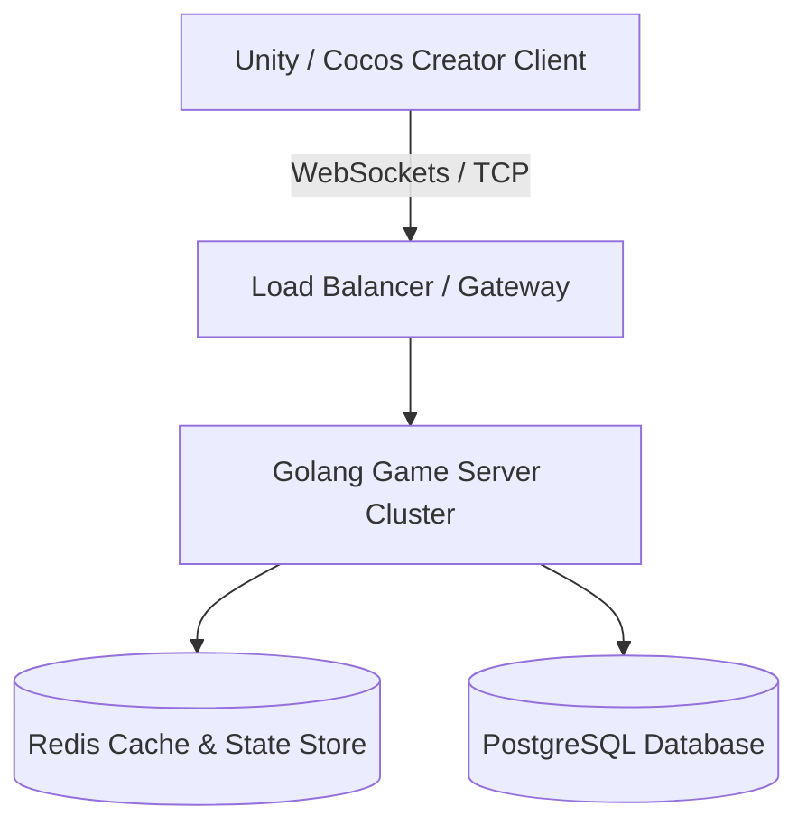

# Bản thiết kế Kiến trúc & Phục dựng Tây Du Ký Mobile (J2ME)

Tài liệu này đặc tả kiến trúc kỹ thuật Client - Server, thiết kế Cơ sở dữ liệu và giải pháp đồng bộ hóa thời gian thực cho dự án phục dựng game Tây Du Ký Mobile.

---

## 1. Kiến trúc Hệ thống Tổng quan (System Architecture)

Hệ thống được thiết kế theo mô hình Client/Server truyền thống tối ưu cho game MMORPG thời gian thực:



### Chi tiết các tầng công nghệ:
1.  **Client (Trình khách):**
    *   **Công nghệ đề xuất:** **Unity (C#)** hoặc **Cocos Creator (TypeScript)**.
    *   **Lý do chọn:** Hỗ trợ thiết kế đồ họa 2D Pixel Art tốt, dễ dàng xuất bản đa nền tảng (Android, iOS, WebGL chơi trực tiếp trên trình duyệt máy tính hoặc điện thoại mà không cần cài đặt).
    *   **Giao diện:** Thiết kế theo tỷ lệ khung hình dọc (Portrait 9:16), tự động co giãn theo độ phân giải thiết bị.
2.  **Server (Trình chủ):**
    *   **Công nghệ đề xuất:** **Golang (Go)**.
    *   **Lý do chọn:** Golang có hiệu năng xử lý concurrency cực cao (thông qua Goroutines), quản lý bộ nhớ tốt và độ trễ cực thấp. Rất phù hợp để xử lý hàng ngàn kết nối đồng thời từ người chơi.
    *   **Giao thức truyền thông:** **WebSockets** (đối với bản chơi trên Web) hoặc **Raw TCP Socket** (đối với bản cài đặt Mobile), dữ liệu được đóng gói bằng định dạng nhị phân nhẹ như **Protobuf** để tối ưu hóa băng thông.

---

## 2. Thiết kế Cơ sở Dữ liệu (Database Design)

Chúng tôi sử dụng kết hợp hai hệ quản trị cơ sở dữ liệu:
*   **PostgreSQL:** Lưu trữ các dữ liệu mang tính bền vững (Tài khoản, Nhân vật, Trang bị sở hữu, Tiên sủng...).
*   **Redis:** Lưu trữ bộ nhớ đệm (Cache) tốc độ cao và quản lý trạng thái trực tuyến (Vị trí tọa độ, Kênh trò chuyện, Danh sách tổ đội online).

### Lược đồ Cơ sở dữ liệu (PostgreSQL Schema) đề xuất:

#### Bảng `characters` (Nhân vật):
```sql
CREATE TABLE characters (
    id SERIAL PRIMARY KEY,
    user_id INT NOT NULL,
    name VARCHAR(50) UNIQUE NOT NULL,
    level INT DEFAULT 1,
    exp INT DEFAULT 0,
    vip_level INT DEFAULT 0,
    hp INT DEFAULT 100,
    mp INT DEFAULT 50,
    gold INT DEFAULT 0, -- Tiền trong game
    knb INT DEFAULT 0,  -- Kim Nguyên Bảo (nạp thẻ)
    mount_id INT,       -- Thú cưỡi đang trang bị
    map_id INT DEFAULT 1, -- ID bản đồ hiện tại
    pos_x INT DEFAULT 10,  -- Tọa độ X dạng lưới (tile)
    pos_y INT DEFAULT 10,  -- Tọa độ Y dạng lưới (tile)
    created_at TIMESTAMP DEFAULT CURRENT_TIMESTAMP
);
```

#### Bảng `mounts` (Danh sách thú cưỡi của người chơi):
```sql
CREATE TABLE character_mounts (
    id SERIAL PRIMARY KEY,
    character_id INT REFERENCES characters(id) ON DELETE CASCADE,
    mount_type_id INT NOT NULL, -- ID của loại thú cưỡi (Bạch Hổ, Kỳ Lân...)
    level INT DEFAULT 1,
    exp INT DEFAULT 0,
    is_active BOOLEAN DEFAULT FALSE -- Có đang cưỡi hay không
);
```

#### Bảng `pets` (Tiên Sủng):
```sql
CREATE TABLE character_pets (
    id SERIAL PRIMARY KEY,
    character_id INT REFERENCES characters(id) ON DELETE CASCADE,
    pet_name VARCHAR(50) NOT NULL,
    pet_type_id INT NOT NULL,
    level INT DEFAULT 1,
    hp INT DEFAULT 50,
    mp INT DEFAULT 20,
    attack INT DEFAULT 10,
    defense INT DEFAULT 5,
    is_summoned BOOLEAN DEFAULT FALSE
);
```

---

## 3. Cơ chế Đồng bộ Hóa và Di chuyển trên Bản đồ dạng lưới (Grid-based Sync)
*   **Cấu trúc bản đồ:** Bản đồ 2D được chia thành một mạng lưới các ô vuông kích thước cố định (ví dụ: 32x32 pixel một ô).
*   **Di chuyển trên lưới:** Khi người chơi bấm di chuyển, Client gửi một gói tin yêu cầu di chuyển ngắn gọn lên Server chứa hướng đi hoặc tọa độ ô đích (`target_x`, `target_y`).
*   **Xác thực phía Server (Server-side Validation):** Server sẽ kiểm tra xem ô đích có hợp lệ không (có vật cản không, khoảng cách di chuyển có vượt quá tốc độ tối đa của nhân vật/thú cưỡi không). Nếu hợp lệ, Server cập nhật tọa độ mới vào Redis và phát sóng (Broadcast) tọa độ mới của người chơi đó cho tất cả các Client khác nằm trong vùng nhìn thấy (Area of Interest - AOI).
*   **Cơ chế AOI (Area of Interest):** Server chỉ gửi cập nhật vị trí của các nhân vật khác nằm trong bán kính hiển thị của người chơi (ví dụ: trong phạm vi 15 ô xung quanh) để giảm thiểu tối đa tải mạng.
*   **Đồng bộ chat:** Kênh chat sử dụng Pub/Sub của Redis để phát tin nhắn chat thế giới hoặc chat bang hội thời gian thực.
